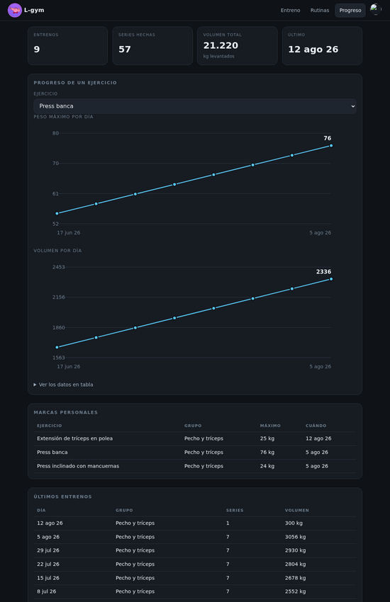
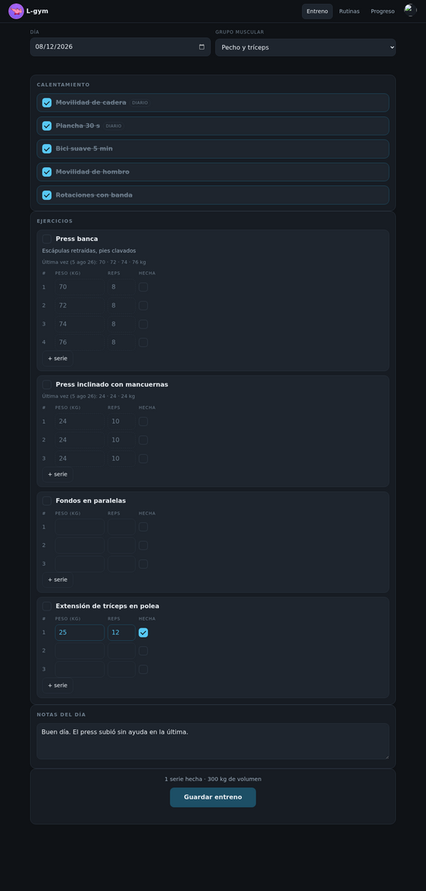
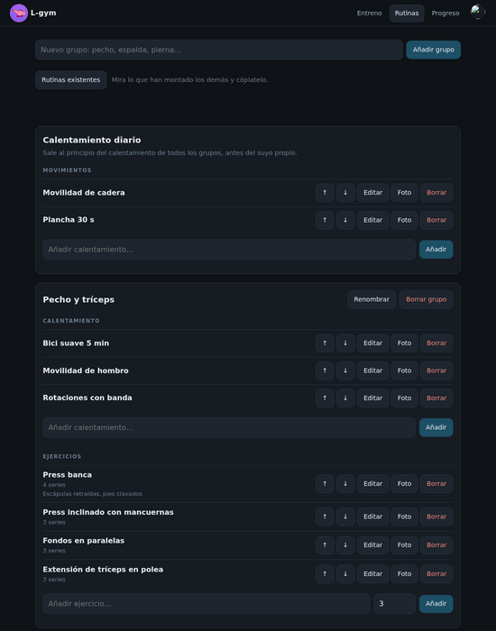
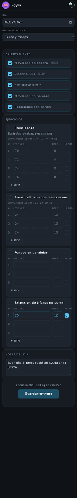
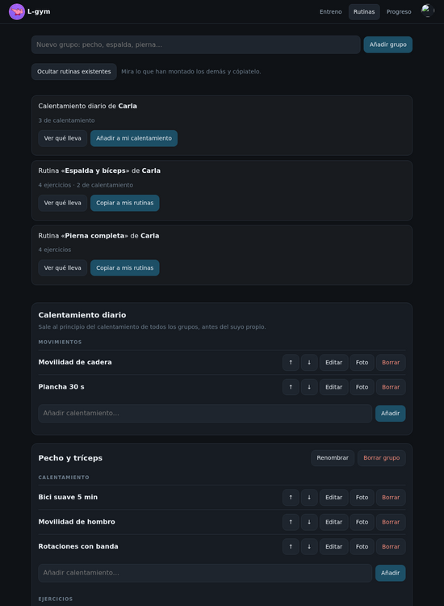
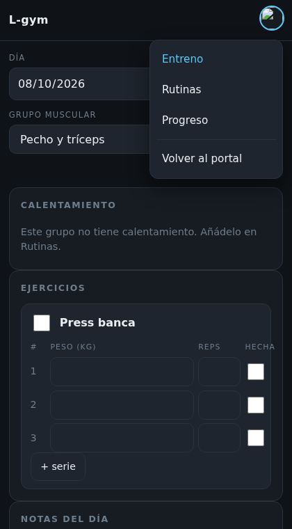

# L-gym

Rutinas de gimnasio y progreso en el tiempo. En producción en
`l-gym.lepayimio.es`, detrás del inicio de sesión compartido de
[lepayimio](https://lepayimio.es).

Express + SQLite, sin dependencias de cliente: los gráficos son SVG generado a
mano. La configuración del servidor vive en
[lepayimio-infra](https://github.com/pelayodesantiago98-ctrl/lepayimio-infra).



| Entreno del día | Rutinas | Móvil |
|---|---|---|
|  |  |  |

<p align="center">
  
</p>
<p align="center"><sub>Las rutinas son de cada uno, pero se pueden mirar y copiar las de los demás.
Al copiar se traen nombre, notas, series y foto; lo levantado no, que es de cada cual.</sub></p>

<p align="center"></p>

## La idea

Una **rutina** por grupo muscular (pecho y tríceps, espalda y bíceps, pierna…).
Dentro de cada grupo hay dos listas separadas a propósito:

- **Calentamiento** — solo una casilla. No se apunta peso porque no interesa.
- **Ejercicios** — casilla, número de series y **peso por cada serie**.

En el gimnasio eliges el grupo del día y vas marcando. Lo que apuntas se
guarda contra la fecha, y de ahí sale el progreso.

## El peso de la última vez

Al abrir un ejercicio aparecen los pesos que hiciste **el último día que lo
tocaste**, para no tener que acordarte. Eso es una **sugerencia**, no un dato
guardado: viaja en una clave aparte de la respuesta (`ultimaVez`) y no se
escribe en la sesión de hoy hasta que tocas la casilla.

Importa la distinción: si se guardara solo, un día que abres la app y no
entrenas quedaría registrado como un entreno completo con los pesos de la
semana pasada, y el progreso mentiría.

`ultimaVezDe()` solo mira series con `hecho = 1` y de fechas **anteriores** a
la de hoy, así que abrir el mismo día dos veces no se sugiere a sí mismo.

## Casillas y botones

Las casillas están **dibujadas**, no son las del navegador. Antes llevaban
`accent-color`, que solo tiñe el relleno de la casilla marcada: sin marcar, el
navegador seguía pintando su cuadrado blanco de siempre, y sobre un fondo casi
negro eran manchas de tiza. Poner `background` no arregla nada, porque un
control con aspecto nativo lo ignora: hay que quitárselo con
`appearance: none` y pintarlo.

La marca es un cuadrado girado 45 grados al que se le dejan dos lados. Sale
más nítida a cualquier tamaño que un carácter de tipografía, que además cambia
según el sistema.

Siguen midiendo 24 px: la casilla de una serie hay que marcarla con el pulgar
y sudando.

`color-scheme: dark` en la raíz es lo que hace que el navegador pinte en
oscuro lo que no controla la hoja de estilos: el desplegable del `<select>`,
el calendario del `<input type=date>` y las flechas de los campos numéricos.
Al ponerlo hubo que **quitar** el `filter: invert(1)` del icono del
calendario, que ya no hacía falta y lo devolvía a negro.

Todo lo pulsable comparte el mismo anillo de foco y se hunde un píxel al
pulsarlo: en el móvil, sin hover, es la única señal de que el toque ha
entrado.

## El calentamiento diario

Aparte del calentamiento propio de cada grupo hay uno **diario**: se configura
una vez en Rutinas y sale al principio de todos los grupos, antes del suyo.

Por dentro **es un grupo más**, con la marca `diario = 1` y fuera del listado.
Así hereda tal cual el editor, las fotos, las notas y el orden de los
ejercicios, en vez de una segunda tabla que hiciera exactamente lo mismo. Se
crea solo la primera vez que se pide la rutina, y la API se niega a borrarlo
aunque la pantalla no ofrezca el botón.

**Marcarlo vale para todo el día, no para una sesión.** Quien entrene pecho
por la mañana y pierna por la tarde ve por la tarde que ya lo hizo. Las marcas
de los diarios se leen de cualquier sesión del mismo día con `MAX(hecho)`, en
vez de la sesión que se esté mirando.

En la pantalla de entreno llevan una etiqueta *diario*: sin ella, ver los
mismos tres movimientos en todos los grupos parece un fallo.

## El menú de la foto

La foto de perfil de la barra **es** el botón del menú. No hay tres rayas al
lado: serían dos controles compitiendo por el mismo sitio y por la misma idea
—«aquí están tus cosas»—, y la foto la sirve el portal, así que ya identifica
la sesión.

Dentro va la misma estructura que en L-games y L-tcg, para que moverse entre
las apps no obligue a reaprender dónde está cada cosa:

```
Pelayo                    ← quién eres
L-gym
Inicio de lepayimio
─────
Entreno · Rutinas · Progreso
─────
Desconectarse
```

Las secciones se repiten en el menú aunque en pantalla ancha ya estén en la
barra. Es a propósito, y es lo que hacen las otras: un menú de una sola línea
no parece un menú.

En móvil, además, las pestañas de la barra desaparecen y el menú es la única
forma de cambiar de sección. No es solo estética: esa fila se iba a una
segunda línea a todo lo ancho y se comía alto de barra pegajosa justo en el
aparato donde menos sobra.

**Desconectarse va contra `/salir` de esta misma app, no contra el del
portal.** El nginx del portal corta con 403 lo que llega de otro origen, y
este subdominio lo es. La galleta es del dominio padre, así que desde aquí se
puede borrar; hay que repetir dominio y ruta exactos o el navegador no la da
por la misma y no la borra.

El menú se oculta con el atributo `hidden`, y hace falta un
`.menu[hidden] { display: none }` explícito: el `display: grid` de la hoja
del proyecto pisa el `[hidden] { display: none }` del navegador —gana la del
autor— y sin esa línea el menú se queda abierto para siempre.

Se cierra tocando fuera y con Escape. Sin eso, en el móvil un menú
abierto por error solo se quita eligiendo algo.

## Guardar el entreno

Todo se guarda solo mientras entrenas —cada casilla, cada peso—, así que el
botón del final no está para que no se pierda nada. Hace dos cosas concretas:

1. **Vacía lo que quede pendiente.** Los campos de peso salen con 600 ms de
   retraso y las notas con 800. Si cierras el móvil justo después de teclear,
   esa última cifra todavía no había salido.
2. **Cierra la sesión**, guardando la hora. Así un día terminado no se
   confunde con uno que se abrió y se abandonó a medias.

Encima del botón va el resumen del día: series hechas y volumen. Sale de lo
que ya está en pantalla, sin pedirle nada al servidor.

Se puede **reabrir**: cierras el entreno y a los dos minutos te acuerdas de una
serie que faltaba. `POST /api/sesion/:id/terminar` con `{"abierto": true}`.

En el cliente, el orden importa: primero se vacían los pendientes y solo
después se marca como terminado. Al revés, el último peso tecleado llegaría a
una sesión ya cerrada.

## Datos

```
grupos      un grupo muscular, por dueño; `diario = 1` marca el que lleva
            el calentamiento de todos los días y no se lista
ejercicios  del grupo; tipo = calentamiento | ejercicio; con foto opcional
sesiones    un día + un grupo (única por dueño, fecha y grupo);
            `terminada` guarda cuándo se cerró, o null si sigue abierta
marcas      hecho/no hecho de los calentamientos
series      peso y repeticiones de cada serie de cada ejercicio
```

Todo lleva `dueno`, que sale del SSO. Las consultas filtran por él siempre: la
app la usa más de una persona y nadie ve la rutina de otro.

## Inicio de sesión

No tiene login propio. Usa el módulo compartido `sso.js`, que valida la cookie
`lepayimio_sesion` firmada por el portal. `app.use(sso.exigirSesion())` va
**antes** del `express.static`, así que ni los ficheros estáticos se sirven sin
sesión.

> **Ojo al desplegar.** El servicio corre como el usuario `lgym`, que no es
> `www-data`, y la clave de firma `/etc/lepayimio/sso.key` es de root. Hace
> falta darle permiso explícito:
>
> ```bash
> setfacl -m u:lgym:r /etc/lepayimio/sso.key
> ```
>
> Sin eso la app arranca igual y **falla en silencio** al validar la cookie:
> todo el mundo ve la pantalla de login para siempre. Por eso `servidor.js`
> comprueba la clave al arrancar y se niega a seguir si no puede leerla.

## Fotos de los ejercicios

Se suben desde la propia app y se procesan con sharp. Van a
`public/imagenes/`, que **no está en el repositorio**: son contenido de quien
usa la app, no del proyecto.

## Endurecimiento

La unit de systemd va con `ProtectSystem=strict` y solo dos rutas escribibles:
`datos/` y `public/imagenes/`. `MemoryMax=256M` porque el VPS tiene 1,8 GB
repartidos entre nueve servicios.

## Las capturas

`herramientas/demo.sh` levanta **una copia** de la app en `/var/tmp` con una
sesión falsa y ocho semanas de datos inventados, la fotografía y la borra. No
toca la instalación real ni su base de datos.

La copia va en `/var/tmp` y no en `/tmp`: `/tmp` aquí es un tmpfs de 921 MB
sobre 1,8 GB de RAM y no le caben ni las dependencias.

## Licencia

Este proyecto se distribuye bajo la **GNU General Public License v3.0**. El texto
completo está en [LICENSE](LICENSE).

    L-gym — rutinas de gimnasio y progreso en el tiempo
    Copyright (C) 2026 Lepayo (@pelayodesantiago98-ctrl)

    Este programa es software libre: puedes redistribuirlo y/o modificarlo
    bajo los términos de la GNU General Public License, en su versión 3,
    tal y como la publica la Free Software Foundation.

    Se distribuye con la esperanza de que resulte útil, pero SIN NINGUNA
    GARANTÍA; ni siquiera la garantía implícita de COMERCIABILIDAD o
    IDONEIDAD PARA UN PROPÓSITO PARTICULAR. Consulta la GNU General Public
    License para más detalles.

    Deberías haber recibido una copia de la GNU General Public License junto
    a este programa. Si no es así, mírala en <https://www.gnu.org/licenses/>.

Qué significa en la práctica: puedes usarlo, estudiarlo, modificarlo y
redistribuirlo; si distribuyes una versión modificada, tienes que publicar su
código con esta misma licencia.

Las rutinas, los pesos y las fotos de ejercicios no están en el repositorio:
son de quien use la instalación.
